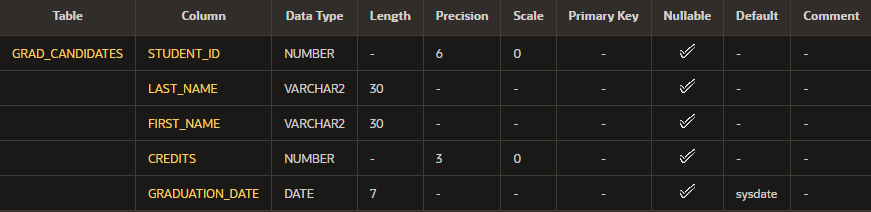

---
title: Práctica: 13-1
author: Agustín Alejandro Mota Hinojosa
geometry: margin=0.5in
...

# Terminología {-}

  ---------------------- ---------------------------------------------------
  Diccionario de datos   Creado y mantenido por el servidor de Oracle;
                         contiene información sobre la base de datos
  Esquema                Recopilación de objetos que son las estructuras
                         lógicas que hacen referencia directa a los datos
                         de la bd
  default                Especifica un valor predefinido si se omite un
                         valor en la sentencia insert
  Tabla                  Almacena los datos; unidad básica de
                         almacenamiento compuesta por filas y columnas
  create table           Comando que se utiliza para crear una nueva tabla
  ---------------------- ---------------------------------------------------

# Inténtelo/Resuélvalo {-}

1.  Complete el gráfico de la instancia de tabla GRADUATE CANDIDATE.
    Credits es una columna de clave ajena que hace referencia a la tabla
    de requisitos.

    ``` {.sql}
    create table grad_candidates
        (student_id number(6),
        last_name varchar2(30),
        first_name varchar2(30),
        credits number(3),
        graduation_date date default sysdate);
    ```

2.  Confirme la creación de la tabla mediante `describe`.

    

3.  Cree una nueva tabla mediante una subconsulta. Asigne su primer
    apellido como nombre de la nueva tabla; por ejemplo, `smith_table`.
    Mediante una subconsulta, copie `grad_candidates` en `smith_table`.

    ``` {.sql}
    create table mota_table
    as (select * from grad_candidates);
    ```

4.  Inserte sus datos personales en la tabla creada en la pregunta 4.

    ``` {.sql}
    insert into mota_table
        (student_id,last_name,first_name,credits,graduation_date)
    values
        (3,'Mota Hinojosa', 'Agustín Alejandro',0,to_date('2025-05-01','YYYY-MM-DD'));
    ```

5.  Consulte el diccionario de datos para cada uno:

    ``` {.sql}
    select * from user_tables;
    select * from user_objects;
    select * from user_cat;
    ```

    En diferentes frases, resuma lo que devolverá cada consulta.

      - user~tables~   Devuelve todas las tablas creadas por el usuario
      - user~objects~   Devuelve todas los objetos creados por el usuario
      - user~catalog~   Devuelve tablas y indices creados por el usuario.
