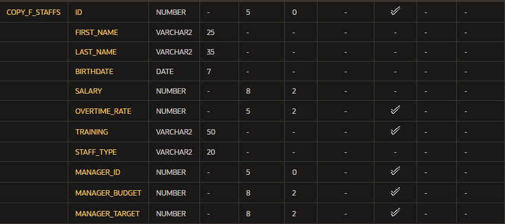
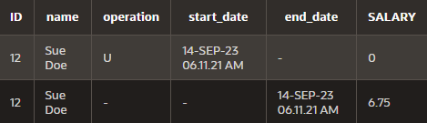

# Inténtalo/Resuélvalo {-}

1.  ¿Por qué es importante poder modificar una tabla?

    **Respuesta**: los datos por lo general nunca son p ermanentes, es
    importante tener la capacida de cambiarlos en el caso de que ya no
    sean como eran antes.

2.  Crear una tabla Artists. a. agregar datos a la tabla

    ``` {.sql}
    create table artists
        (artist_id number primary key,
         first_name varchar2(20),
         last_name varchar2(30),
         group_name varchar2(30),
         email varchar2(30),
         hourly_rate varchar2(20),
         song_id number,
         constraint fk_artist_song foreign key(song_id)
         references d_songs(song_id));
    ```

    b\. insertar un artista desde `d_songs`

    ``` {.sql}
    insert into artists
        (first_name,last_name,group_name,email,hourly_rate,song_id)
    values
        ('','','The hobbits','',100,45);
    ```

    c\. insertar un artista

    ``` {.sql}
    insert into artists
        (first_name,last_name,group_name,email,hourly_rate,song_id)
    values
        ('Björn','Both','Santiano','info@elephantmusic.com',100,null);
    ```

    d\. Proporionar ejemplos para:

    1.  `alter table`

        ``` {.sql}
        alter table artists
            add (platform varchar2(10));

        update table artists
            set (platform = 'spotify')
        where artist_id = 1;
        ```

    2.  `drop table`

        ``` {.sql}
        create table copy_artists
            as (select * from artists);

        drop table copy_artists;
        ```

    3.  `rename table`

        ``` {.sql}
        create table copy_artists
            as (select * from artists);

        rename copy_artists to cp_artists;
        ```

    4.  `truncate`

        ``` {.sql}
        truncate table cp_artists;
        ```

    5.  `comment on table`

        ``` {.sql}
        comment on table cp_artists
            is 'esta es una copia de artists';
        ```

3.  Introducir una nueva columna a la tabla `o_employees`
    \"Termination\".

    ``` {.sql}
    alter table o_employees
        add (termination varchar2(20) default to_char(sysdate,'Month DDth,YYYY'));
    ```

4.  Crear unanueva columna en la tabla `o_employees` denominada
    `start_date`.

    ``` {.sql}
    alter table o_employees
        add(start_date timestamp with local time zone);
    ```

5.  Truncar la tabla o~jobs~. ¿Siguen allí las columnas? ¿Siguen allí
    los datos?

    ``` {.sql}
    truncate table o_jobs;
    select * from o_jobs;
    ```

    **Respuesta**: no, los datos han sido borrados pero los atributos de
    la tabla persisten; la base de datos devuelve: `no data found`.

6.  ¿Cuál es la diferencia entre `TRUNCATE`, `DELETE` y `DROP` para las
    tablas?

    -   `truncate`: vacía los datos de la tabla pero los atributos de la
        tabla se quedan.
    -   `delete`: es un comando DML y se usa para remover datos de
        columnas.
    -   `drop`: es un comando DDL y se usa para remover constraints o
        columnas.

7.  Enumere los cambios que se pueden y no se pueden realizar en una
    columna.

    1.  Agregar una columna
    2.  Modificar una columna
    3.  Eliminar una columna
    4.  Definir valor default en una columna

8.  Agregue el siguiente comentario a la tabla o~jobs~: \"New job
    description added\"

    ``` {.sql}
    comment on table o_jobs
        is 'New job description added';
    ```

9.  Cambie el nombre de la tabla o~jobs~ a `o_job_description`.

    ``` {.sql}
    rename o_jobs to o_job_description;
    ```

10. Ejercicios con la tabla `f_staffs`: a) Cree una copia de la tabla
    `f_staffs` denominada `copy_f_staffs` y utilice esta copia de tabla
    para las prácticas restantes de esta lección.

    ``` {.sql}
    create table copy_f_staffs
        as (select * from f_staffs);
    ```

    b\) Describa la nueva tabla para asegurarse de que existe.

    ``` {.sql}
    desc copy_f_staffs;
    ```

     c) Borre la tabla.

    ``` {.sql}
    drop table copy_f_staffs;
    ```

    d\) Intente realizar una selección en la tabla.

    ``` {.sql}
    select * from copy_f_staffs;
    ```

    e\) Observe la papelera de reciclaje para ver dónde está la tabla.

    ``` {.sql}
    select * from user_recyclebin;
    ```

    f\) Intente seleccionar desde la tabla borrada mediante el valor
    almacenado en la columna `OBJECT_NAME`. Deberá copiar y pegar el
    nombre como es exactamente y especificar el nombre nuevo entre
    comillas dobles. Por lo tanto, si el nombre borrado que le devuelve
    es `BIN$Q+x1nJdcUnngQESYELVIdQ==$0`, deberá escribir una consulta
    que haga referencia a `"BIN$Q+x1nJdcUnngQESYELVIdQ==$0"`.

    ``` {.sql}
    select * from 'BIN$Q+x1nJdcUnngQESYELVIdQ==$0';
    ```

    g\) Anule el borrado de la tabla.

    ``` {.sql}
    flashback table copy_f_staffs to before drop;
    ```

    h\) Describa la tabla.

    ``` {.sql}
    desc copy_f_staffs;
    ```

11. Siga con la tabla copy~fstaffs~ y realice una actualización de la
    tabla. a) Emita una sentencia SELECT para ver todas las filas y
    todas las columnas de la tabla `copy_f_staffs`.

    ``` {.sql}
    select * from copy_f_staffs;
    ```

    b\) Cambie el salario de Sue Doe a 12 y confirme el cambio.

    ``` {.sql}
    update copy_f_staffs
        set salary = 12
    where id = 12;
    ```

    c\) Emita una sentencia SELECT para ver todas las filas y todas las
    columnas de la tabla `copy_f_staffs`.

    ``` {.sql}
    select * from copy_f_staffs;
    ```

    d\) Para Sue Doe, actualice el salario a 2 y confirme el cambio.

    ``` {.sql}
    update copy_f_staffs
        set salary = 2
    where id = 12;
    ```

    e\) Emita una sentencia SELECT para ver todas las filas y todas las
    columnas de la tabla `copy_f_staffs`.

    ``` {.sql}
    select * from copy_f_staffs;
    ```

    f\) Ahora, emita una sentencia FLASHBACK QUERY en la tabla
    copy~fstaffs~, para que pueda ver todos los cambios realizados.

    ``` {.sql}
    select id, first_name || ' ' || last_name as "name",
        versions_operation as "operation",
        versions_starttime as "start_date",
        versions_endtime as "end_date", salary
    from copy_f_staffs
        versions between scn minvalue and maxvalue
    where employee_id = 12;
    ```

     g) Investigue el resultado
    de f), busque el salario original y actualice la columna de salario
    de la tabla copy~fstaffs~ para Sue Doe a su salario original.

    ``` {.sql}
     update copy_f_staffs
        set salary = 6.75
    where id = 12;
    ```
