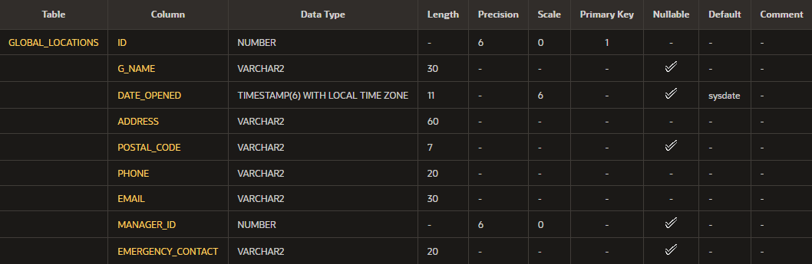

---
title: "Práctica: 14-1"
author: "Agustín Alejandro Mota Hinojosa"
geometry: margin=0.5in
...

# Terminología {-}
1. Cada valor de una columna o un juego de columnas (una clave compuesta)
    debe ser único. 

    **Respuesta**: `unique (columna1, columna2)`

2. Para cada fila que se introduce en la tabla, debe haber un valor
    para la columna. 

    **Respuesta**: `primary key`

3. La restricción garantiza que la columna no contiene ningún valor
    nulo e identifica de forma exclusiva cada fila de la tabla.
    
    **Respuesta**: `not null`

4. Especifica una condición de una columna que debe ser verdadera para cada
    fila de datos. 

    **Respuesta**: `check`

5. Identifica la tabla y la columna en la tabla principal.

    **Respuesta**: `foreign key`

6. Restricción de integridad que requiere que cada uno de los valores de una.
    columna o de un juego de columnas sea único.

    **Respuesta**: `constraint unique`

7. Designa una columna (tabla secundaria) que establece una relación entre una.
    clave primaria de la misma tabla y otra tabla (tabla principal).

    **Respuesta**: `foreign key`

8. Hace referencia a una o más columnas y se define con independencia de las.
    definiciones de las columnas de la tabla.

    **Respuesta**: `index`

9. Regla de base de datos.

    **Respuesta**: `constraint`

10. Regla de base de datos que hace referencia a una sola columna.

    **Respuesta**: `column constraint`

# Inténtelo/Resuélvalo {-}
1.  ¿Qué es una “restricción” en relación con la integridad de los datos?

    **Respuesta**: Es una regla que se impone a la hora de insertar datos
    dentro de una tabla.

2. ¿Cuáles son las limitaciones de las restricciones que se pueden aplicar a
    nivel de columna y a nivel de tabla?

    **Respuesta**:

    1. La sentencia a nivel de columna solo se puede definir en la sentencia
        `create table` como parte de la definición de la columna.
    2. Las restricciones a nivel de tabla se muestran después de que se hayan
        definido todas las columnas de la tabla.

3. ¿Por qué es importante dar nombres significativos a las restricciones?

    **Respuesta**: Para poder distinguir cada una de las restricciones,
    sino el sistema le pondrá un nombre automáticamente que no da
    ningún contexto.

4. Basándose en la información proporcionada por los propietarios, seleccione
    un tipo de dato para cada columna. Indique la longitud, la precisión y la
    escala de cada tipo de dato NUMBER.

    - `id: number`
    - `name: varchar2(30)`
    - `date opened: timestamp with local time zone`
    - `address: varchar2(60)`
    - `city: varchar2(20)`
    - `zip/postal code: varchar(7)`
    - `phone: varchar(20)`
    - `email: varchar2(30)`
    - `manager id: number`
    - `emergency contact: varchar(20)`

5. Utilice “valores nulos” para indicar aquellas columnas que pueden tener
    valores nulos.

    - `emergency contact: valores nulos`
    - `zip: valores nulos`

6. Escriba la sentencia CREATE TABLE para la tabla de ubicaciones de Global
    Fast Foods a fin de definir las restricciones a nivel de columna.

    ``` sql
    create table global_locations
    (id number(6) primary key,
     g_name varchar(30),
     date_opened timestamp with local time zone default sysdate,
     address varchar(60) not null,
     postal_code varchar(7),
     phone varchar(20) not null,
     email varchar(30) not null,
     manager_id number(6),
     emergency_contact varchar(20),
     );
    ```
7. Ejecute la sentencia CREATE TABLE en Oracle Application Express.

    ``` sql
    desc global_locations
    ```

8. Ejecute un comando DESCRIBE para ver la información de resumen de la tabla.

    

9. Reescriba la sentencia CREATE TABLE para la tabla de ubicaciones de Global
    Fast Foods a fin de definir las restricciones UNIQUE a nivel de tabla.

    ``` sql
    create table global_locations
    (id number(6) primary key,
     g_name varchar(30),
     date_opened timestamp with local time zone default sysdate,
     address varchar(60) not null,
     postal_code varchar(7),
     phone varchar(20) not null,
     email varchar(30) not null,
     manager_id number(6),
     emergency_contact varchar(20),
     constraint email_phone_uk unique(email,phone)
     );
    ```

